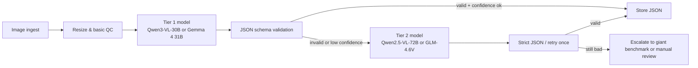

# Последние open-weight VLM для задачи ice-cream image-to-JSON

## Executive summary

На сегодня я бы делил рынок не по «красоте демо», а по трем уровням практичности. Уровень качества-потолка — это гиганты вроде Kimi K2.6, Mistral Large 3, InternVL3.5-241B и Qwen3-VL-235B: они интересны как benchmark, но почти все требуют слишком тяжелой инфраструктуры для нормальной продовой экономики. citeturn17view3turn21view0turn40view0turn24view2

Для реального self-host и быстрой первой волны тестов лучше всего выглядят Qwen3-VL-30B, Qwen2.5-VL-72B, GLM-4.6V, Gemma 4 31B и Mistral Small 4: у них уже есть либо hosted API с нормальной multimodal поддержкой и JSON, либо понятный self-host стек через vLLM/SGLang/Transformers. citeturn24view0turn23view1turn37search4turn17view2turn30view0

Если для вас критичен именно strict structured output, а не просто «модель умеет написать JSON текстом», то strongest evidence сейчас такое: у OpenRouter это видно по `supported_parameters` с `structured_outputs`, у DeepInfra есть документированный `json_schema`, у Hugging Face Inference Providers есть отдельная документация по structured outputs, а для self-host это уже умеют backend’ы вроде vLLM, SGLang и LMDeploy. citeturn23view1turn23view2turn26view0turn36search0turn24view4turn6search0turn6search1turn6search2

Для вашей задачи важнее всего не абстрактный MMMU, а комбинация из трех вещей: OCR на упаковке/витрине, стабильный JSON по схеме, и цена/скорость на 30–50k фото в день. По этой комбинации я бы первым делом прогонял Qwen3-VL-30B, Qwen2.5-VL-72B, GLM-4.6V, Gemma 4 31B и Mistral Small 4; а Qwen3-VL-235B и Mistral Large 3 оставил бы как quality ceiling. citeturn24view0turn35view0turn37search1turn22search2turn31view0turn24view2turn22search3

Сама цель 30–50k изображений в сутки не выглядит страшной: это всего примерно 0.35–0.58 изображения в секунду в среднем. Поэтому узкое место у вас не «суточный объем» как таковой, а выбор модели, отключение ненужного reasoning, batching, ограничение output tokens и минимизация retry на невалидном JSON. 

Мой практический вывод жесткий: если хочется один боевой старт без лишней экзотики, берите Qwen3-VL-30B как главный self-host кандидат, Qwen2.5-VL-72B как зрелый OCR-heavy baseline, GLM-4.6V как сильного hosted конкурента, Gemma 4 31B как дешевый dense-контраст, и один очень большой benchmark — либо Qwen3-VL-235B, либо Mistral Large 3. citeturn24view0turn35view0turn37search1turn22search2turn24view2turn22search3

## Как читать этот shortlist

Ниже я сознательно разделяю **strict structured output** и **JSON-by-prompt**.  
Если у провайдера/бэкенда есть `structured_outputs` или `json_schema`, это я считаю надежным режимом. Если есть только `response_format=json_object`, это уже лучше обычного prompting, но все равно не равно гарантированной валидации по схеме. citeturn23view1turn23view2turn23view3turn23view0turn36search0turn24view4

Оценки OCR / product-fit ниже — это **proxy-оценки** по официальным model cards, multimodal benchmark claims, Doc/OCR/document-understanding claims и наличию native JSON/function calling. У большинства моделей нет официального food-specific benchmark, поэтому для мороженого это все равно нужно прогонять на вашей тестовой выборке. citeturn35view0turn38view0turn30view0turn17view2turn40view0

VRAM ниже — это **инженерная оценка по весам**, а не vendor SLA:  
BF16/FP16 ≈ 2 байта на параметр, 8-bit ≈ 1 байт, 4-bit ≈ 0.5 байта; для практического inference нужен запас под vision encoder, KV cache, runtime overhead и batching. Для MoE это особенно важно: даже если активных параметров мало, хранить на GPU приходится весь checkpoint или шардировать его по нескольким GPU. 

Для normalized cost я использую простую сравнимую модель: **1k изображений ≈ 1.0M input tokens + 0.2M output tokens**. Это не provider-reported image pricing, а нормированная оценка, чтобы сравнить токеновые тарифы между собой. Реальная стоимость зависит от image tokenization конкретной модели и вашего max output. 

Для self-host строгий JSON уже документирован у urlvLLM Structured Outputs docsturn6search0, urlSGLang Structured Outputs docsturn6search1 и urlLMDeploy JSON Schema docsturn6search2; для hosted-провайдеров это документируют urlHugging Face Inference Providers Structured Outputsturn24view4 и urlDeepInfra Structured Outputs docsturn36search0. citeturn6search0turn6search1turn6search2turn24view4turn36search0

## Топ-10 моделей, отсортированных по размеру

Размеры, лицензии, hosted-опции и supported stacks в таблице ниже опираются на официальные model cards и provider pages, ссылки даны в последнем столбце.

| Rank | Модель / exact ID | Size class | Open-weight status | Лицензия | Hosted API / provider | Structured output status | OCR / product-fit для вашей задачи | Normalized hosted cost / 1k imgs | Итог |
|---|---|---:|---|---|---|---|---|---:|---|
| 1 | `moonshotai/Kimi-K2.6` | 1.1T total / 32B active | Да | Modified MIT | Official API + HF provider presence | **Provider strict schema needs verification**; self-host strict JSON через backend | Очень высокий потолок, но docs фокусируются больше на agentic/coding/design, чем на OCR-packaging | needs verification | **Benchmark only** |
| 2 | `mistralai/Mistral-Large-3-675B-Instruct-2512` | 675B total / 41B active | Да | Apache-2.0 | OpenRouter | **Да** на OpenRouter (`structured_outputs`) | Высокий reasoning + JSON, но сам card прямо пишет, что он *behind vision-first models* в multimodal tasks | ~$0.80 | **Benchmark only** |
| 3 | `OpenGVLab/InternVL3_5-241B-A28B` | 241B total / 28B active | Да | Apache-2.0 | Public hosted pricing не подтвержден | **Backend-only** (vLLM/SGLang/LMDeploy route) | Очень высокий мультимодальный потолок; сильный OCR/doc stack в series docs | needs verification | **Benchmark / cluster-only** |
| 4 | `Qwen/Qwen3-VL-235B-A22B-Instruct` | 235B total / 22B active | Да | needs quick legal verification on exact checkpoint; family appears Apache-2.0 | DeepInfra | **Да** на DeepInfra (`json_schema` / JSON) | Один из лучших vision-first open-weight quality ceilings; сильный кандидат на fine-grained visual parsing | ~$0.38 | **Benchmark + hosted test** |
| 5 | `mistralai/Mistral-Small-4-119B-2603` | 119B total / 6.5B active | Да | Apache-2.0 | OpenRouter | **Да** на OpenRouter (`structured_outputs`) | Очень сильный general-purpose image+JSON вариант; хорош для extraction и reasoning, не чисто vision-first | ~$0.27 | **Test seriously** |
| 6 | `zai-org/GLM-4.6V` | 106B total | Да | MIT | DeepInfra + Z.ai | **Да** на DeepInfra JSON; **Да** в Z.ai structured output docs | Сильный document/OCR/function-calling профиль; очень адекватен для витрин, упаковки и mixed scenes | ~$0.48 | **Test seriously** |
| 7 | `Qwen/Qwen2.5-VL-72B-Instruct` | 72B total | Да | Apache-2.0 | OpenRouter | **Да** на OpenRouter (`structured_outputs`) | Самый зрелый OCR-heavy baseline из списка: explicit OCRBench/DocVQA/document claims | ~$0.40 | **Top baseline + self-host candidate** |
| 8 | `google/gemma-4-31B-it` | 30.7B dense | Да | Apache-2.0 | OpenRouter / HF ecosystem | На OpenRouter виден `response_format`, но не `structured_outputs`; strict schema лучше делать через HF/DeepInfra/self-host backend | Сильный dense latest model; хорош как дешевый современный contrast model | ~$0.21 | **Test** |
| 9 | `Qwen/Qwen3-VL-30B-A3B-Instruct` | 30B total / 3B active | Да | Apache-2.0 | DeepInfra | **Да** на DeepInfra JSON | Лучший практический компромисс для вашего кейса: vision-first, дешевле 72B+, влезает в разумное железо | ~$0.27 | **Best self-host candidate** |
| 10 | `mistralai/Ministral-3-3B-Instruct-2512` | ~3.8B total | Да | Apache-2.0 | OpenRouter | **Да** на OpenRouter (`structured_outputs`) | Это нижний floor: быстрый, сверхдешевый, edge-friendly, но fine-grained вкус/toppings/brand OCR likely будет слабее больших моделей | ~$0.12 | **Edge floor / weak-tail control** |

| Docs |
|---|
| urlHF cardturn17view3 · urldeploy guideturn17view4 |
| urlHF cardturn21view0 · urlOpenRouter pricingturn22search3 |
| urlHF cardturn40view0 |
| urlHF cardturn40view1 · urlDeepInfra catalogturn24view2 |
| urlHF cardturn30view0 · urlNVFP4 cardturn32view0 · urlOpenRouter pricingturn29search1 |
| urlHF cardturn38view0 · urlDeepInfra pricingturn37search1 · urlZ.ai structured output docsturn37search2 |
| urlHF cardturn35view0 · urlOpenRouter metadataturn23view1 · urlw4a16 quant benchmarkturn35view1 |
| urlHF cardturn17view2 · urlOpenRouter pricingturn22search2 |
| urlHF cardturn8view1 · urlDeepInfra pricingturn24view0 |
| urlHF cardturn27view1 · urlOpenRouter pricingturn28search2 |

## Развертывание, VRAM и пропускная способность

Таблица ниже — это **практическая инженерная оценка**, рассчитанная из официальных размеров моделей, заявленных precision/quantized checkpoints и рекомендуемых inference stacks из model cards. Для throughput я предполагаю один image request, downsizing до ~1024 px, `reasoning/thinking=off`, `max_output_tokens` примерно 192–256 и батчинг с умеренной очередью.

| Модель | FP16/BF16 веса, total VRAM | 8-bit | 4-bit / low-bit | Рекомендуемые кванты | Поддерживаемые стеки | Минимальное железо, чтобы просто завести | Batch size ориентир | Реалистичный план на 30k / 50k изображений в сутки |
|---|---:|---:|---:|---|---|---|---|---|
| Kimi K2.6 | ~2200 GB | ~1100 GB | ~550 GB | native INT4 | Transformers, vLLM, SGLang, KTransformers | **8×H200 / TP8**; на обычных 80GB серверах нецелесообразно | 1–2 | 30k/50k feasible только на тяжелом 8-GPU узле или hosted API |
| Mistral Large 3 675B | ~1350 GB | ~675 GB | ~338 GB | FP8, NVFP4 | vLLM officially; Transformers support lagged at release | **8×H100/A100 в NVFP4** или **8×H200/B200 в FP8** | 1–4 | Для 30–50k/day нужен полноценный 8-GPU node; как продуктовый вариант почти всегда overkill |
| InternVL3.5-241B | ~482 GB | ~241 GB | ~121 GB | community/partner quants; exact best format needs verification | Transformers, vLLM, SGLang, LMDeploy | **8×A100 80GB** — это прямо близко к официальной рекомендации по семейству | 1–2 | 30k/day возможно; 50k/day уже требует агрессивного batching и очень аккуратного image budget |
| Qwen3-VL-235B | ~470 GB | ~235 GB | ~118 GB | official FP8 + community GGUF/AWQ ecosystem | Transformers, vLLM, SGLang, llama.cpp ecosystem | Практически **8×80GB BF16** или экспериментально меньше в low-bit | 1–4 | 30–50k/day doable на 4–8 GPU, но экономика хуже, чем у 30B/72B |
| Mistral Small 4 119B | ~238 GB | ~119 GB | ~60 GB | FP8, NVFP4, Eagle | vLLM, Transformers, SGLang, llama.cpp | **2×80GB** — самый реалистичный entry-point; official serve example идет с TP2 | 4–8 | 30–50k/day — нормальная цель на 2×H100 / 2×A100 80GB |
| GLM-4.6V | ~212 GB | ~106 GB | ~53 GB | fp8 hosted; low-bit self-host needs verification | Transformers, vLLM, SGLang | **2×80GB** комфортно; 1×80GB только в aggressive low-bit | 4–8 | 30–50k/day realistic на 2×80GB, особенно если output короткий и JSON строгий |
| Qwen2.5-VL-72B | ~144 GB | ~72 GB | ~36 GB | AWQ, FP8, w4a16 | Transformers, vLLM, SGLang, llama.cpp GGUF | **1×80GB** в 8-bit/4-bit для «завести», **4×A100/H100** для throughput | 4–8 | Это уже боевой кандидат: 30–50k/day реально даже с запасом; у w4a16 есть паблик multi-stream benchmarks |
| Gemma 4 31B | ~61 GB | ~31 GB | ~15 GB | community quants / GGUF ecosystem | Transformers, vLLM, SGLang, llama.cpp path via quantizations | **1×80GB BF16** или **1×24–48GB** в low-bit | 8–16 | 30–50k/day можно закрыть одним сильным GPU-узлом, если accuracy окажется достаточной |
| Qwen3-VL-30B | ~60 GB | ~30 GB | ~15 GB | official FP8 + community GGUF/AWQ | Transformers, vLLM, SGLang, llama.cpp ecosystem | **1×80GB BF16** или **1×24–48GB** в 4/8-bit | 8–16 | Самый здоровый practical sweet spot: один H100/A100 80GB или 2×4090 уже выглядят реалистично |
| Ministral 3 3B | ~7.6 GB | ~3.8 GB | ~1.9 GB | official FP8, GGUF, ONNX | vLLM, Transformers, OpenRouter, WebGPU-ish edge demos | **1×8GB** уже enough per official card | 32+ | 30–50k/day легко, но качество на fine-grained мороженом почти наверняка проседает |

30k/day = **0.347 img/s**, 50k/day = **0.579 img/s**. Это означает, что ваш target throughput берется **не гигантами**, а уже нормальными 30B–72B моделями, если вы не убьете latency длинным reasoning и не оставите output без жесткого лимита.

Отдельно важный факт по зрелым throughput-цифрам: для `Qwen2.5-VL-72B-Instruct-quantized.w4a16` опубликованы multi-stream benchmark’и на 4×A100 и 4×H100, где throughput на vision tasks существенно выше вашего суточного target даже с запасом; это делает 72B-класс уже вполне нормальным кандидатом на production, а не только benchmark. citeturn35view1

## Комментарии по каждой модели

**Kimi K2.6** — это monster benchmark, а не первая продовая ставка. У него 1T total params, 32B active, native INT4 и официальный деплой через vLLM/SGLang/KTransformers с примером на single-node H200 TP8, плюс официальный API. Для вашей задачи он интересен, если вы хотите понять quality ceiling open-weight мира, но как первый self-host выбор это почти наверняка лишняя боль. citeturn18view3turn18view0turn17view4

**Mistral Large 3 675B** силен тем, что уже официально рекламирует native function calling и JSON outputting, а OpenRouter для него явно показывает `structured_outputs`. Но сам model card честно предупреждает, что он может отставать от vision-first моделей в multimodal tasks; для ice-cream extraction это значит: годится как сильный generalist benchmark, но не как первый production bet. citeturn21view0turn23view2

**InternVL3.5-241B-A28B** — один из самых серьезных open multimodal кандидатов вообще. По card он state-of-the-art среди open-source MLLM across general multimodal, reasoning, OCR/doc and agentic tasks, плюс прямо описаны OCR/chart/document understanding, DvD deployment и ViR routing; но цена входа по железу высокая, а понятного hosted pricing я публично не нашел. citeturn40view0

**Qwen3-VL-235B-A22B-Instruct** — один из лучших quality-ceiling вариантов именно для image-to-JSON. У Qwen3-VL family есть сильный vision-first positioning, official FP8 checkpoints, 256k hosted context на DeepInfra и JSON support на provider side; для вашего кейса это один из лучших hosted benchmark’ов перед финальным self-host выбором. citeturn24view2turn24view0turn12view0

**Mistral Small 4 119B** неожиданно практичнее, чем название намекает. У него 119B total, но только 6.5B active, есть reasoning toggle, JSON output, function calls, official NVFP4 checkpoint и OpenRouter `structured_outputs`. Если нужна одна сильная универсальная модель между «гигантами» и «разумным продом», это очень крепкий кандидат. citeturn30view0turn32view0turn31view0

**GLM-4.6V** выглядит очень сильным hosted вариантом именно для extraction-heavy задач. У него 106B size class, explicit multimodal document understanding, native multimodal function calling, DeepInfra JSON support и отдельная структурированная output capability в Z.ai docs. Для упаковки, брендов, витрин и сложных mixed scenes это один из лучших mid-large hosted вариантов. citeturn38view0turn37search1turn37search2

**Qwen2.5-VL-72B-Instruct** — самый зрелый и понятный 72B baseline. В official card прямо заявлены structured outputs, stable JSON for coordinates/attributes, strong OCR/doc ability и сильные DocVQA/OCRBench результаты; на OpenRouter у него есть `structured_outputs`, а для w4a16 опубликованы self-host throughput numbers. Если хотите один надежный OCR-first baseline, это он. citeturn35view0turn23view1turn35view1

**Gemma 4 31B** — лучший новый dense-контраст в этом shortlist. Он свежий, multimodal, 256k context, variable image resolution, OpenRouter pricing у него очень приятный, а само железо для него существенно проще, чем у 72B+. Но важная оговорка: в OpenRouter metadata у него виден `response_format`, а не явный `structured_outputs`, так что strict schema лучше делать через self-host backend или через провайдера, который документирует JSON Schema enforcement. citeturn17view2turn23view0turn24view4turn36search0

**Qwen3-VL-30B-A3B-Instruct** — мой главный practical favorite для вашего проекта. Он уже есть на DeepInfra с JSON support и в очень адекватном price band, относится к vision-first Qwen3-VL линии, имеет official FP8 and community quantization ecosystem и попадает в sweet spot по размеру: достаточно сильный для fine-grained tests, но уже не безумный по железу. Если завтра запускать self-host прототип, я бы начинал отсюда. citeturn24view0turn24view1turn12view1

**Ministral 3 3B** — это не победитель по качеству, а нижняя контрольная линия. Он хорош тем, что влезает в 8GB VRAM в FP8, умеет vision, JSON outputting и даже имеет `structured_outputs` на OpenRouter. Для large-scale дешевого inference или edge floor он полезен, но на fine-grained вкусах, топпингах, мелком OCR и сложных витринных сценах от него стоит ждать заметно хуже результаты, чем у 30B–72B класса. citeturn27view1turn26view0

## Практический план деплоя на 30–50k фото в сутки

Если убрать маркетинг, цель у вас простая: **0.35–0.58 img/s sustained**. Это не требует магии. Это требует нормальной операционной дисциплины.

Первое: **не гоняйте full-resolution фото как есть**.  
Для витрин/упаковок и single product almost always достаточно ресайза до 896–1024 px по длинной стороне, если только у вас бренды не очень мелкие. Для сложной упаковки с мелким текстом можно делать fallback path на 1344 px и только для изображений, где baseline confidence низкий. Это сильно бьет по цене и latency лучше любого «выберем самую умную модель».

Второе: **режьте output**.  
Ваш JSON не должен генерировать полстраницы рассуждений. Держите `temperature=0`, `reasoning/thinking=off`, `max_output_tokens=192–256`, короткий `summary`, один retry на invalid JSON и дальше fail-fast в очередь ручной проверки.

Третье: **делайте tiered routing**.  
Большинство фото single cone / cup / package не требуют 100B+ модели. Реалистичный routing такой:
- tier 1: Qwen3-VL-30B или Gemma 4 31B — весь поток;
- tier 2: Qwen2.5-VL-72B или GLM-4.6V — только low-confidence / OCR-hard / display_case / multiple-items;
- tier 3: giant benchmark (Qwen3-VL-235B или Mistral Large 3) — только для анализа failure cases и sporadic evaluation.

Четвертое: **смотрите не только на tok/s, а на schema success rate**.  
На практике победит не та модель, которая чуть лучше отвечает на бенчмарке, а та, которая дает меньше invalid JSON, меньше hallucinated brands и ниже retry rate на плохих фото.

Самые реалистичные hardware-пути я бы видел так:

- **Один узел, минимально разумный старт:**  
  `Qwen3-VL-30B-A3B-Instruct` на 1×H100 80GB или 1×A100 80GB, либо в low-bit на 2×4090. Это самый адекватный путь для первого self-host smoke/soak test.

- **Один узел, чуть более надежный OCR baseline:**  
  `Qwen2.5-VL-72B-Instruct` в w4a16/AWQ/FP8, лучше всего 4×A100 80GB или 2×H100 80GB, если нужен запас по batching и throughput.

- **Дешевый dense-контраст:**  
  `Gemma 4 31B` на 1×80GB или low-bit на 24–48GB классе GPU.

- **Если хотите универсальный Mistral-путь:**  
  `Mistral Small 4` в FP8/NVFP4 на 2×80GB.

## Финальная рекомендация

Если цель — **завтра начать боевое тестирование**, а не собирать музей VLM, я бы делал так.

**Первая волна тестов**
1. `Qwen/Qwen3-VL-30B-A3B-Instruct` — главный практический кандидат.  
2. `Qwen/Qwen2.5-VL-72B-Instruct` — зрелый OCR-heavy baseline.  
3. `zai-org/GLM-4.6V` — сильный hosted competitor с хорошим doc/OCR/function профилем.  
4. `google/gemma-4-31B-it` — дешевый dense contrast.  
5. `mistralai/Mistral-Small-4-119B-2603` — сильный универсальный JSON/reasoning competitor.  

**Quality ceiling / benchmark only**
- `Qwen/Qwen3-VL-235B-A22B-Instruct`
- `mistralai/Mistral-Large-3-675B-Instruct-2512`
- `OpenGVLab/InternVL3_5-241B-A28B`

**Self-host finalists с реальным шансом стать production**
- `Qwen/Qwen3-VL-30B-A3B-Instruct`
- `Qwen/Qwen2.5-VL-72B-Instruct`
- `google/gemma-4-31B-it`
- запасной route: `mistralai/Mistral-Small-4-119B-2603`

**Edge / cheap tail**
- `mistralai/Ministral-3-3B-Instruct-2512` — только как нижняя контрольная линия и дешёвый хвост, не как главный кандидат.

## Open questions / limitations

Я **не включал** каждый community fork, GGUF mirror и каждый экспериментальный HF upload. Я отобрал официальный recent shortlist, где есть нормальные model cards, лицензии и внятные признаки годности под продукт.

У нескольких новых моделей число параметров и family-level precision/quantization задокументированы лучше, чем конкретные публичные p50/p95 self-host latency benchmarks. Поэтому разделы про throughput и batch size — это **операционные оценки**, а не vendor SLA.

Per-image pricing у hosted провайдеров почти никогда не публикуется как отдельная величина: обычно есть только токеновые тарифы. Поэтому колонка с cost/1k images — **нормализованная инженерная оценка**, а не официальный прайс.

Для `Qwen3-VL-235B-A22B-Instruct` я бы перед коммерческим sign-off еще раз руками перепроверил точный license field именно у этого checkpoint. Для family-level Qwen evidence указывает на Apache-2.0, но для legal checklist я бы делал буквальную verification по конкретному repo.

Я сознательно **не поставил в топ-10** `Llama 4 Maverick`, хотя это важная open-weight multimodal модель, потому что для вашей прикладной задачи комбинация из custom license / operational friction / EU-related ambiguity делает ее менее практичной, чем Apache/MIT кандидаты выше. Based on practicality, это правильный skip в first wave.